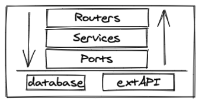

# simple-js-node
A simple Javascript Node application to be used as a template for any Javascript project.
## Architecture
The architecture is divided in three main layers:
- **Routers**: in charge of recieving requests, validate them and select the appropiate service(s) needed to fulfill the request.
- **Services**: each one with a unique purpose, in charge of applying all business related logic as well as selecting the ports that fulfill its purpose.
- **Ports**: simple connectors to either a database or an external APIs, must include at most data related logic.  

## Libraries
Library | Description
------------ | -------------
express | Create routers for nodeJS
express-async-errors  | All express errors will be catched by trycatch  
express-winston | Default application logger 
body-parser | Parse express POST body into json
joi | Add validations for routers and services
loglevel | Main router, service and port logger
mongoose | ODM for MongoDB database
winston | General error logger

## Development

Library | Description
------------ | -------------
@babel | Enable ES6 modules
eslint  | Enable static analysis   
jest | Enable testing 
faker | Enable to build fake data in generate for testing
nodemo | Node runner that restarts node if the source code changes
prettier | Code formatting tool that enforce an standarized code style
